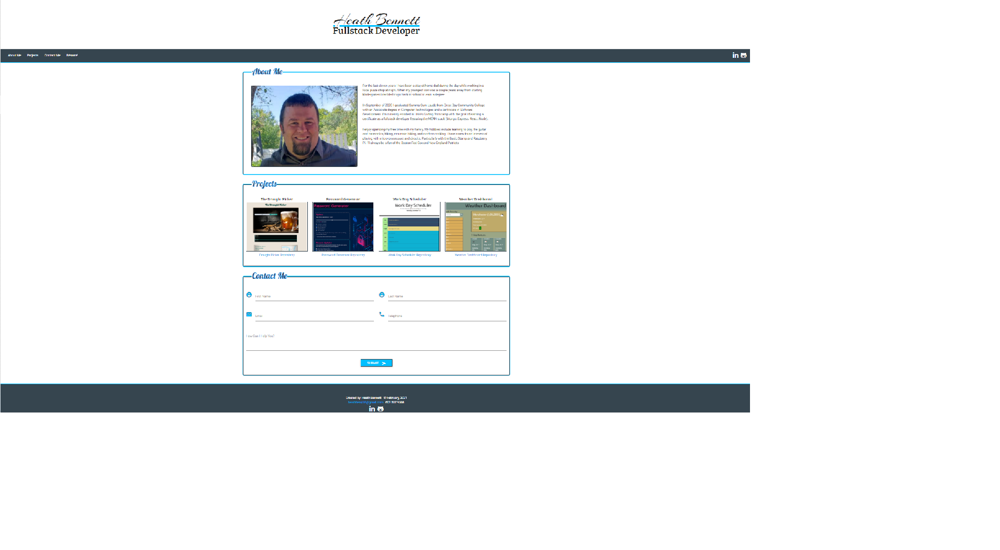
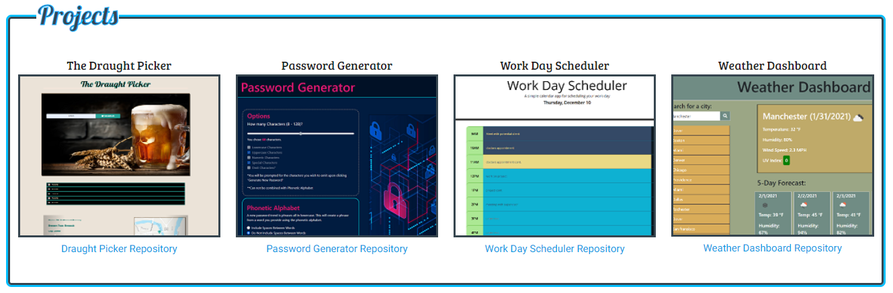
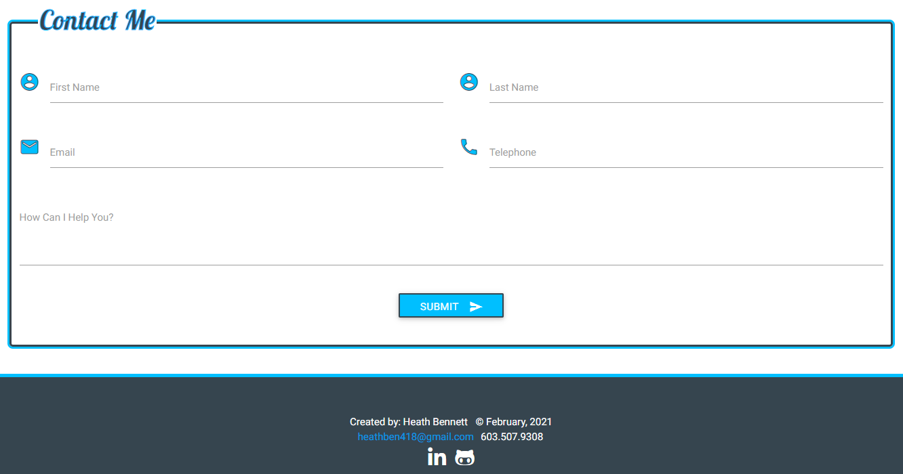

# Portfolio of Heath Bennett

&nbsp;

## Product Description

This site is the personal portfolio for Heath Bennett.  The page contains three sections About Me, Projects, and Contact Me.  The portfolio contains links to a downloadable Résumé, LinkedIn profile, and GitHub account. 

&nbsp;

[Link to GitHub repository](https://github.com/Heath-Bennett/HBPortfolio)

[Link to deployed page](ind)

&nbsp;

## Table of Contents

&nbsp;

* [Image of Index.html](#Image-of-Index.html)
* [About Me](#About-Me)
* [Projects](#Projects)
* [Contact Me](#Contact-Me)
* [Resources Used](#Resources-Used)
* [Colors Used](#Colors-Used)
* [License](#License)

&nbsp;

## Image of Index.html

&nbsp;

[Table of Contents](#Table-of-Contents)

&nbsp;

## About Me

This section gives a brief personal background as well as recent education.

&nbsp;

[Table of Contents](#Table-of-Contents)

&nbsp;

## Projects
This section list projects I have worked on.  For each project a title, screenshot of image, and link to the project repository is supplied.  When the screenshot is hovered over with a mouse it enlarges.  When the screenshot is clicked it brings the user to the deployed page of the project. 

&nbsp;

[Table of Contents](#Table-of-Contents)

&nbsp;

## Contact Me
This section provides the user with means to contact the user through form submission.

&nbsp;

[Table of Contents](#Table-of-Contents)

&nbsp;

## Resources Used

&nbsp;

[Font Awesome](https://fontawesome.com/)

[Google Fonts](https://fonts.google.com/)

[Materialize](https://materializecss.com/)

[Table of Contents](#Table-of-Contents)

&nbsp;

## Colors Used

&nbsp;

`#36454F`                  |  `#00BFFF`                |`#FFFFFF`
:-------------------------:|:-------------------------:|:-------------------------:
  |  | 

[Table of Contents](#Table-of-Contents)

&nbsp;

## License

&nbsp;

MIT License

Copyright (c) [2021] [Heath Bennett]

Permission is hereby granted, free of charge, to any person obtaining a copy
of this software and associated documentation files (the "Software"), to deal
in the Software without restriction, including without limitation the rights
to use, copy, modify, merge, publish, distribute, sublicense, and/or sell
copies of the Software, and to permit persons to whom the Software is
furnished to do so, subject to the following conditions:

The above copyright notice and this permission notice shall be included in all
copies or substantial portions of the Software.

THE SOFTWARE IS PROVIDED "AS IS", WITHOUT WARRANTY OF ANY KIND, EXPRESS OR
IMPLIED, INCLUDING BUT NOT LIMITED TO THE WARRANTIES OF MERCHANTABILITY,
FITNESS FOR A PARTICULAR PURPOSE AND NONINFRINGEMENT. IN NO EVENT SHALL THE
AUTHORS OR COPYRIGHT HOLDERS BE LIABLE FOR ANY CLAIM, DAMAGES OR OTHER
LIABILITY, WHETHER IN AN ACTION OF CONTRACT, TORT OR OTHERWISE, ARISING FROM,
OUT OF OR IN CONNECTION WITH THE SOFTWARE OR THE USE OR OTHER DEALINGS IN THE
SOFTWARE.

[Table of Contents](#Table-of-Contents)