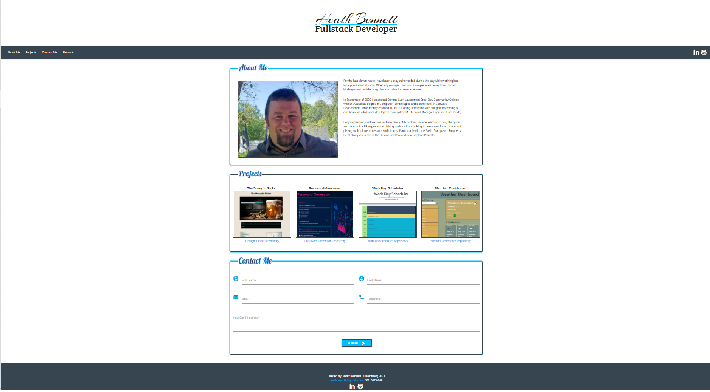

# Portfolio of Heath Bennett

&nbsp;

## Product Description
__________________

This site is the personal portfolio for Heath Bennett.  The page contains three sections About Me, Projects, and Contact Me.  The portfolio contains links to a downloadable Résumé, LinkedIn profile, and GitHub account. 

&nbsp;

[Link to GitHub repository](https://github.com/Heath-Bennett/HBPortfolio)

[Link to deployed page](https://heath-bennett.github.io/HBPortfolio/)

&nbsp;

## Table of Contents
__________________

&nbsp;

* [Image of Index.html](#Image-of-Index.html)
* [About Me](#About-Me)
* [Projects](#Projects)
* [Contact Me](#Contact-Me)
* [Resources Used](#Resources-Used)
* [Colors Used](#Colors-Used)
* [License](#License)

&nbsp;

## Image of Index.html
-----------

&nbsp;

&nbsp;

## About Me
----------

This section gives a brief personal background as well as recent education.

&nbsp;

&nbsp;

## Projects
-----------
This section list projects I have worked on.  For each project a title, screenshot of image, and link to the project repository is supplied.  When the screenshot is hovered over with a mouse it enlarges.  When the screenshot is clicked it brings the user to the deployed page of the project. 

&nbsp;

&nbsp;

## Contact Me
----------
This section provides the user with means to contact the user through form submission.

&nbsp;

&nbsp;

## Resources Used
-----------

&nbsp;

[Font Awesome](https://fontawesome.com/)

[Google Fonts](https://fonts.google.com/)

[Materialize](https://materializecss.com/)

&nbsp;

## Colors Used 
--------

&nbsp;

`#36454F`                  |  `#00BFFF`                |`#FFFFFF`
:-------------------------:|:-------------------------:|:-------------------------:
  |  | 

&nbsp;

## License
------------

&nbsp;

